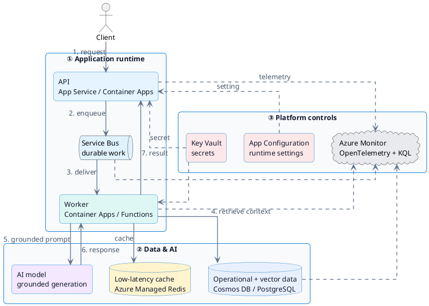

# End-to-end AI backend architecture

AI-200의 서비스는 서로 독립된 목록이 아닙니다. 아래 reference flow는 네 domain을 하나의 production AI application으로 연결합니다.

!!! tip "Interactive architecture"
    [전체 화면에서 AI-200 architecture 탐색하기](ai-200-end-to-end.html){ target="_blank" }

  Theme 전환, zoom, component 검색, 관계 추적, presentation mode와 image export를 사용할 수 있습니다.

## 설계 질문

| 요구 사항 | 먼저 볼 서비스 또는 기능 |
| --- | --- |
| image version과 build 자동화 | Azure Container Registry, ACR Tasks |
| HTTP traffic 기반 간단한 container hosting | App Service 또는 Container Apps |
| event-driven worker scale | Container Apps의 KEDA |
| Kubernetes API와 cluster-level control | AKS |
| durable command와 consumer processing | Service Bus |
| 상태 변화의 fan-out notification | Event Grid |
| semantic retrieval | Cosmos DB vector, PostgreSQL pgvector, Redis vector index |
| secret rotation | Key Vault |
| runtime feature setting | App Configuration |
| component 간 latency 추적 | OpenTelemetry와 Application Insights |

!!! tip "시험 문제 읽기"
    먼저 durability, ordering, latency, scale, operational control, consistency 요구를 표시한 뒤 서비스를 선택합니다.