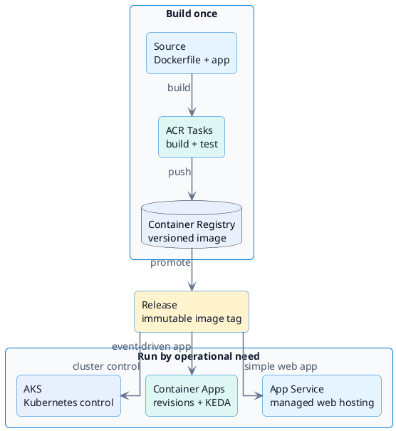

# Container hosting과 orchestration

## Image lifecycle

## Platform 선택

| 요구 사항 | 일반적인 선택 | 이유 |
| --- | --- | --- |
| Web app을 최소 운영 부담으로 hosting | App Service | HTTP application hosting과 platform integration |
| Microservice, revision, event-driven scale | Container Apps | managed environment와 KEDA 기반 scaling |
| Kubernetes control plane API와 세밀한 orchestration | AKS | manifest, workload, network policy에 대한 높은 제어 |

선택은 “더 강력한 서비스”가 아니라 필요한 운영 제어 수준에 따라 결정합니다. AKS는 유연하지만 cluster 운영 책임도 커집니다.

## 구현 checklist

- Image tag를 `latest` 하나에 의존하지 않고 release를 식별합니다.
- Runtime secret을 image layer에 포함하지 않습니다.
- Container Apps revision 간 traffic과 rollback을 고려합니다.
- KEDA scaler가 보는 event source와 threshold를 확인합니다.
- AKS 장애는 pod log뿐 아니라 event, service endpoint, DNS, network path를 함께 봅니다.

## 짧은 실습

다음 조건에 맞는 platform을 고르고 이유를 설명합니다.

> Queue 길이에 따라 0에서 확장되는 document worker가 필요하다. Kubernetes cluster 자체를 운영할 팀은 없다.

핵심 후보는 **Azure Container Apps + KEDA**입니다. Queue 기반 scaler와 managed orchestration 요구에 맞기 때문입니다.

!!! info "공식 자료"
    [Container Apps revisions](https://learn.microsoft.com/en-us/azure/container-apps/revisions), [KEDA scaling in Container Apps](https://learn.microsoft.com/en-us/azure/container-apps/scale-app), [Deploy to AKS](https://learn.microsoft.com/en-us/azure/aks/learn/quick-kubernetes-deploy-cli)