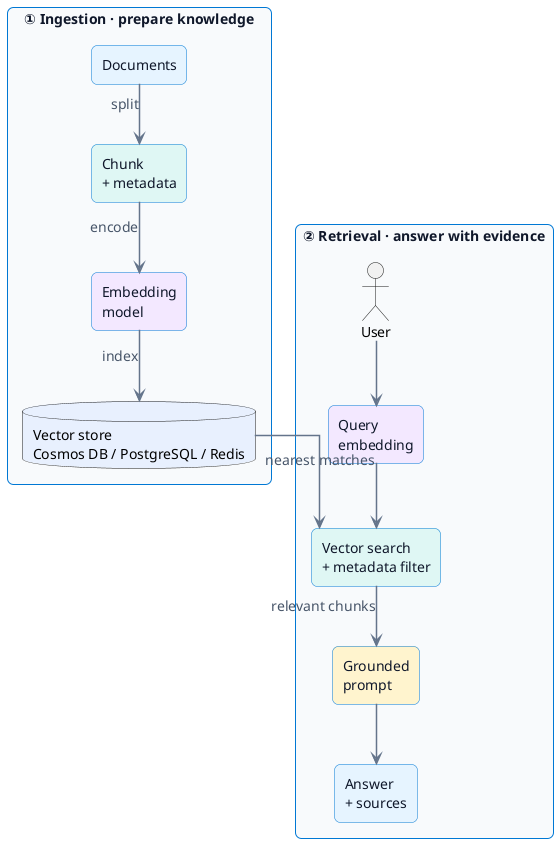

# Vector data와 RAG

Embedding은 content의 의미를 vector로 표현합니다. Query embedding과 가까운 vector를 찾아 관련 content를 model context에 넣는 것이 semantic retrieval의 기본입니다.

## Ingestion과 retrieval

## Cosmos DB 핵심

- Partition key는 data distribution과 query scope를 결정합니다.
- Indexing policy와 query pattern을 함께 설계해 RU 소비를 관리합니다.
- Consistency level은 freshness, latency, availability trade-off입니다.
- Change feed processor는 새 항목과 변경 항목에 반응해 embedding 갱신 같은 작업을 수행할 수 있습니다.

## PostgreSQL 핵심

- Relational data와 vector를 같은 transaction model에서 다룰 때 유용합니다.
- `pgvector` index와 distance metric은 query 특성에 맞게 선택합니다.
- Metadata filter로 candidate 범위를 줄이면 relevance와 비용을 개선할 수 있습니다.
- Connection pool과 compute, memory, storage 설정은 throughput과 latency에 직접 영향을 줍니다.

## Azure Managed Redis 핵심

- 자주 사용하는 response나 retrieval result를 expiration과 함께 cache합니다.
- Write/update 시 invalidation 책임을 명확히 합니다.
- Vector index는 low-latency similarity search가 필요한 경우 고려합니다.

## 판단 질문

1. Data의 source of truth는 어디인가?
2. Query는 relational join, distributed JSON access, low-latency cache 중 무엇이 중심인가?
3. Vector와 metadata filter를 함께 사용해야 하는가?
4. Update가 생기면 embedding과 cache를 누가 갱신하는가?

!!! info "공식 자료"
    [Vector search in Azure Cosmos DB](https://learn.microsoft.com/en-us/azure/cosmos-db/nosql/vector-search), [pgvector on Azure Database for PostgreSQL](https://learn.microsoft.com/en-us/azure/postgresql/extensions/how-to-use-pgvector), [Vector search in Azure Managed Redis](https://learn.microsoft.com/en-us/azure/redis/overview-vector-similarity)