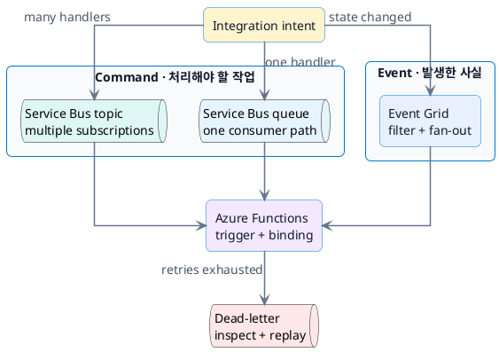

# Messaging, events, Functions

## Message와 event 선택

## Service Bus

- Queue는 sender와 receiver를 시간적으로 분리합니다.
- Topic과 subscription은 동일 message를 여러 workflow에 전달합니다.
- Retry가 끝난 poison message는 dead-letter queue에서 원인과 metadata를 조사합니다.
- Duplicate 처리 가능성을 고려해 consumer를 idempotent하게 설계합니다.

## Event Grid

- Event는 “무언가 발생했다”는 사실을 전달합니다.
- Filter로 event type이나 subject에 따라 subscriber를 제한합니다.
- Retry와 dead-letter destination을 설계해 delivery failure를 관찰합니다.

## Azure Functions

- Trigger는 function 실행 원인이고 binding은 input/output service 연결을 단순화합니다.
- HTTP trigger는 가벼운 serverless API에, queue/event trigger는 background handler에 적합합니다.
- Timeout, concurrency, retry, hosting plan을 workload 특성에 맞게 설정합니다.
- Function code가 실패해도 message loss나 중복 side effect가 없도록 처리합니다.

## 짧은 실습

PDF upload 뒤 extraction, embedding, indexing을 수행하는 pipeline을 설계합니다. Upload notification은 Event Grid로 시작할 수 있지만, 실제 처리 단계는 Service Bus message로 durable하게 분리하는 방안을 검토합니다.