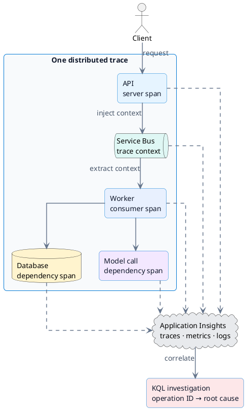

# Security와 observability

## Configuration 경계

| 값 | 저장 위치 | 예시 |
| --- | --- | --- |
| Secret | Key Vault | API key, connection credential, certificate |
| Non-secret setting | App Configuration | endpoint name, threshold, feature flag |
| Deployment-specific reference | Hosting platform configuration | Key Vault reference, configuration endpoint |

가능하면 workload identity와 managed identity로 credential 자체를 줄입니다. Secret을 source code, image layer, log, exception message에 남기지 않습니다.

## Distributed request 추적



## OpenTelemetry

- Trace는 한 request의 component 간 경로와 latency를 보여 줍니다.
- Span에는 operation name, duration, status와 필요한 attribute를 기록합니다.
- Message를 거칠 때 trace context를 전파해야 producer와 consumer를 연결할 수 있습니다.
- Metric은 rate, error, duration, saturation 추세를 보여 주고 log는 상세 event를 제공합니다.

## KQL 시작점

```kusto
requests
| where timestamp > ago(1h)
| where success == false
| project timestamp, operation_Id, name, resultCode, duration
| order by timestamp desc
```

실제 table과 field는 telemetry source와 workspace 설정에 따라 다릅니다. 먼저 실패 request의 `operation_Id`를 찾고 dependency와 trace를 같은 operation으로 연결합니다.

## Troubleshooting 순서

1. 사용자 영향과 시간 범위를 확인합니다.
2. 실패율, latency, saturation 변화를 metric에서 찾습니다.
3. Trace에서 느리거나 실패한 component를 식별합니다.
4. 관련 log와 dependency result를 KQL로 좁힙니다.
5. Configuration, identity, network, quota, retry 상태를 검증합니다.
6. 수정 후 같은 telemetry로 회복을 확인합니다.

!!! info "공식 자료"
    [OpenTelemetry with Application Insights](https://learn.microsoft.com/en-us/azure/azure-monitor/app/opentelemetry-enable), [KQL overview](https://learn.microsoft.com/en-us/kusto/query/)